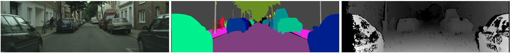

# ViP-DeepLab

## Introduction

In this repository, we present the datasets and the toolkits of [ViP-DeepLab](https://arxiv).
ViP-DeepLab is a unified model attempting to tackle the long-standing and challenging inverse projection problem in vision, which we model as restoring the point clouds from perspective image sequences while providing each point with instance-level semantic interpretations.
Solving this problem requires the vision models to predict the spatial location, semantic class,
and temporally consistent instance label for each 3D point.
ViP-DeepLab approaches it by jointly performing monocular depth estimation and video panoptic segmentation.
We name this joint task as Depth-aware Video Panoptic Segmentation (DVPS), and propose a new evaluation metric along with two derived datasets for it.
This repository includes the datasets SemKITTI-DVPS and Cityscapes-DVPS along with the evaluation toolkits.

[](https://www.cs.jhu.edu/~syqiao/ViP-DeepLab/ViP-DeepLab_v3.mp4)


## Datasets

### SemKITTI-DVPS
SemKITTI-DVPS is derived from [SemanticKITTI](http://semantic-kitti.org/) dataset.
SemanticKITTI dataset is based on the odometry
dataset of the [KITTI Vision benchmark](http://www.cvlibs.net/datasets/kitti/index.php).
SemanticKITTI dataset provides perspective images and panoptic-labeled 3D point clouds.
To convert it for DVPS, we project the 3D point clouds onto the image plane and name the derived dataset as SemKITTI-DVPS.
SemKITTI-DVPS is distributed under [Creative Commons Attribution-NonCommercial-ShareAlike](https://creativecommons.org/licenses/by-nc-sa/4.0/) license.
The dataset and the evaluation toolkit are in the folder `semkitti-dvps`.


### Cityscapes-DVPS
Cityscapes-DVPS is derived from [Cityscapes-VPS](https://github.com/mcahny/vps) by adding re-computed depth maps from [Cityscapes](https://www.cityscapes-dataset.com/) dataset.
Cityscapes-DVPS is distributed under [Creative Commons Attribution-NonCommercial-ShareAlike](https://creativecommons.org/licenses/by-nc-sa/4.0/) license.
The dataset and the evaluation toolkit are in the folder `cityscapes-dvps`.



## Citation
If you use the datasets in your research, please cite our project.
```BibTeX
@article{vip_deeplab,
  title={ViP-DeepLab},
  author={Authors},
  journal={arXiv preprint arXiv:xxxx.xxxxx},
  year={2020}
}
```
